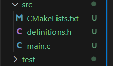
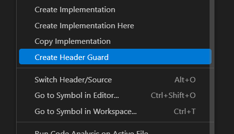

# Embbebed class 19/05

First important thing: 
>Cayetano required us to always determine the number of bits for intiger that each variable is going to use. So, the use of the data_type ***int* is forbbiden**. 

The ones that we must ALWAYS use are either *uint_16_t* or *uint_8_t* or *uint_32_t*, etc.

The number of bits that you will put after *"uint"* depends on the number that the variable with this type would store. For example: 
>If i want to store an intiger number that would probably have a value ranging from 0 to 250, i could use the **uint8_t** type. Because, 2^8=256. And it aplys to any number you want to store, the greater it is, the number of bits you would have to consider. 

In that case that the value within the variable reaches or exceeds the capable value that the type can store:
```C
uint8_t x = 260; //exceeds the "uint8_t" range. 
printf("%d\n", x);  // ¿Qué imprime?
```
The output would be:
```C
260 % 256 = 4 //Value modulus of the max capacity of the type. 
```
-----

The uint64_t, for example, is a typedef that defines an **unsigned long long** 64-bit integer type.  
```C
typedef unsigned long long uint64_t;
```
- *uint64_t* comes from the *_stdint.h* library. 
- The "_t" at the end is because of that we are declaring a **type**. 

## typedef 
```C
typedef uint64_t u64_t; // to rename uint64_t to u64_t
```
This "data type" help us to rename the data types. 

Why would we use it?
- To make code easier to read

- To simplify complex type declarations

- To make your own custom types (like structs) more readable

With the above contexte we developed the following code in class: 
```C
#include <stdio.h>
#include <esp_timer.h>

typedef uint64_t u64_t; // to rename uint64_t to u64_t
u64_t current_time,prev_time; // get current time in microseconds

void app_main() {
    u64_t current_time; // get current time in microseconds
    u64_t prev_time = esp_timer_get_time();
    while (true){
        current_time = esp_timer_get_time();
        if (current_time - prev_time >= 500000) { // 500 miliseconds
            prev_time = current_time;
            printf("Hello World \n");
        }
    }
}
```
Where it main pourpuse was to print in the SerialMonitor the string "Hello World" every 500 miliseconds with space between each other. 
- Also, we managed to use the library **<esp_timer.h>** in order to apply its function **esp_timer_get_time()** that returns the time in microseconds. 

## Files *".h"*

- The ***.c*** file works for the execution and main development of the code.  
- The **.h** files work for either the declaration or definition of variables that would be used in the *.c* code. 
    - Thus, the ***.h*** files must be always saved within the source archive: 
    

Frome the above class code we passed the definitions and declarations to the *"declarations.h"*, as shown bellow: 
```C
#ifndef __DEFINITIONS_H__
#define __DEFINITIONS_H__

#include <stdio.h>
#include <esp_timer.h>

typedef uint64_t u64_t; // to rename uint64_t to u64_t
u64_t current_time,prev_time; // get current time in microseconds

#endif // __DEFINITIONS_H__
```
NOTE: When initializing a *.h* file, it is initially empty so, in order to fill it with the initial required code, we press the right button followed by the bellow button. 

- Right clik: Create Header guide. 



Having that, we could left the *.c* code as follows: 
```C
#include "definitions.h"

void app_main() {
    prev_time = esp_timer_get_time();
    while (true){
        current_time = esp_timer_get_time();
        if (current_time - prev_time >= 500000) { // 500 miliseconds
            prev_time = current_time;
            printf("Hello World \n");
        }
    }
}
```
Just including the *"definitions.h"* int he upper part of the code. 